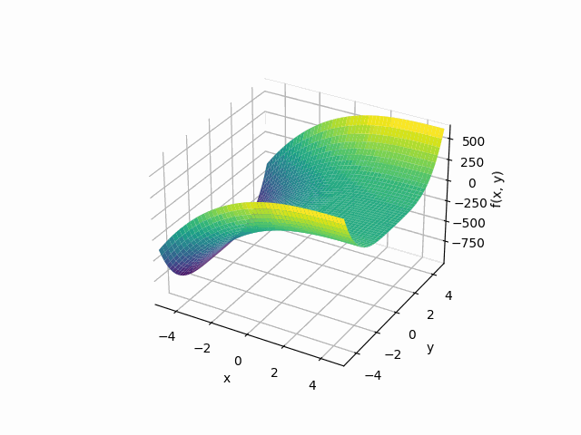

# SymPy for Calculus


I wanted to plot functions between a range of input values, then sweep through them from low to high and visualize the result.

I came up with a simple CLI with a defined multi-variable function to plot in 3 dimensions, so I can experiment at the CLI with providing different ranges, though my next improvement will be tweaking the actual function signature from the CLI, instead of hardcoded.

CLI params are for passing min, max, and step values. Plots are generated for every iteration performed and written to a temporary directory as PNGs. Images are collected and smashed, resulting in an animation (as `.gif`).

## Usage

```bash
python3 calculus.py --name "animation" --min "-5" --max "5" --step "0.3"
```

## Code

```python
# calculus.py
import argparse
import os
import shutil
import tempfile
import time

import numpy as np
import sympy as sp
from PIL import Image


x, y, z = sp.symbols('x y z')


def F(i: int = 0):
    f = (x + i)**3 + y**4
    return f


def graph(f, xr: list, yr: list, image: str):
    sp.plotting.plot3d(
        (f, (x, xr[0], xr[1]), (y, yr[0], yr[1])),
        show=False
    ).save(image)


def animate(cwd: str, gif: str, path: str, iterations: int):
    """
    Collect plots in order and create gif.
    """
    print('Collecting plots to generate animation.')
    images = [Image.open(f'{path}/{n}.png') for n in range(iterations)]
    images[0].save(gif,
                   save_all=True,
                   append_images=images[1:],
                   duration=100,
                   loop=0)
    time.sleep(5)
    shutil.move(gif, cwd)
    print(f'Animation {gif.split("/")[-1]} successfully created.')


def run_loop():

    args = get_args()

    with tempfile.TemporaryDirectory() as tmpdir:
        iterations = 0

        print(f'Function: {F()}')
        print(f'Plotting min: {args.min} to max: {args.max}')
        for i, j in enumerate(
                np.arange(float(args.min), float(args.max), float(args.step))):
            iterations += 1
            image_file = f'{tmpdir}/{i}.png'
            print(f'Plotting {F(j)} in {image_file}')
            graph(F(j), [-5, 5], [-5, 5], image_file)

        cwd = os.getcwd()
        gif = f'{tmpdir}/{args.name}.gif'

        animate(cwd, gif, tmpdir, iterations)


def get_args() -> argparse.Namespace:
    """
    Parse CLI args
    """
    parser = argparse.ArgumentParser()
    parser.add_argument('--name', '-n')
    parser.add_argument('--min')
    parser.add_argument('--max')
    parser.add_argument('--step', '-s')
    return parser.parse_args()


if __name__ == '__main__':
    run_loop()

```



$$f(x, y) = (x + i)^{3} + y^{4}$$

$$\scriptsize -5 \le i \le 7, step = 0.4$$


## Nice printing:

You can generate the Latex code for your functions (for use in markdown, by wrapping them with `$`):

```ipython
In [1]: import sympy
In [2]: x, y, z = sympy.symbols('x y z')
In [3]: sympy.print_latex(x**3 + y**4)
x^{3} + y^{4}
```

Or enable Latex printing in ipython or Jupyter:

```python
sympy.init_printing()
```

## Other ideas

I'd like to plot derivatives and integrals to see their "movement" as second, third, fourth derivatives/integrals are performed. I'd also like to print LateX to the CLI, for prettiness. And upload the jupyter notebook I used for developing this, with more ideas.


